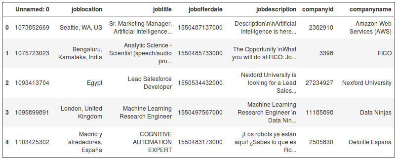

Linkedin Scrapper App
================

Projet
------

L'objectif de l'application est de crawler des offres d'emplois sur le site Linkedin via la librairie Selenium. Les paramètres enregistrés permettent au robot de mimer le comportement d'un être humain parcourant le site : il scroll down les pages, il parcourt les pages sans ordre fixe, il prend des pauses, et ne travaille pas plus de 8h d'affilé. Néanmoins, Linkedin peut parfois avoir des doutes faire passer un test *NOCaptcha*, auquel cas, le robot ne pourra pas continuer son travail sans l'intervention de l'homme.

Installation
------------

-   Cloner le projet avec la commande :

<!-- -->

    git clone https://github.com/hansglick/linkedin_scrapper.git

-   Constuire et l'environnement conda

<!-- -->

    cd conda_env
    conda env create -f environment.yml
    source activate lkdn_env

Définir les paramètres de l'application
---------------------------------------

Le fichier conf.py comprend tout les paramètres de l'application :

-   **BIGPATH** : le chemin absolu du repo (le chemin crée du repo cloné)
-   **chrome\_path** : le chemin absolu du dossier driver
-   **duree\_journee\_type** : La durée du crawl en secondes (par défaut, 8 heures)
-   **duree\_max\_travail\_continue** : durée des sessions de travail du robot, i.e. travail sans pause (par défaut, 1h30). Au bout d'une heure et demie environ, le robot prend une pause
-   **sleep\_dico** : dictionnaire python comprenant les paramètres qui définissent les durées des différentes pauses du robot
-   **slaves\_dico** : dictionnaire python dont les clés représentant un compte Linkedin. Pour chaque compte linkedin, on compte un username, un password, une recherche linkedin
-   **scraping\_name** : le nom du dossier qui contiendra toutes les informations crawlées. Ex : scraping\_name = deep\_learning\_job\_offers. Ce dossier sera présent dans le repo cloné.

Lancer le robot
---------------

Une fois le fichier conf.py renseigné correctement, on lance le crawler d'annonces avec la commande suivante :

    python app.py

Convertir les données crawlées au format csv
--------------------------------------------

Les jobs offers sont stockées dans le fichier pickle jobsdico.p à la racine du repo. Il s'agit d'un dictionnaire python. Afin de convertir ce fichier en csv, puis de traiter les données à l'aide de la librairie pandas, on peut lancer les commandes suivantes :

    python convert_dict_to_csv.py

    jupyter lab
    import pandas as pd
    df = pd.read_csv("job_offers.csv", sep = "\t")
    df.head()

En vidéo
--------

